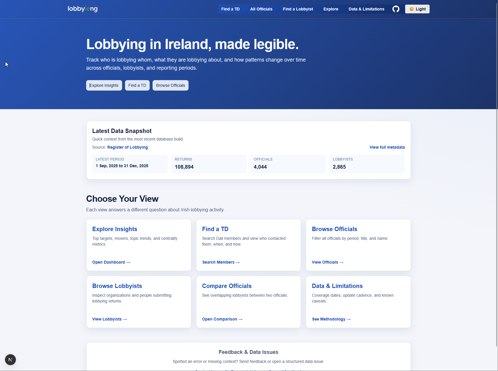
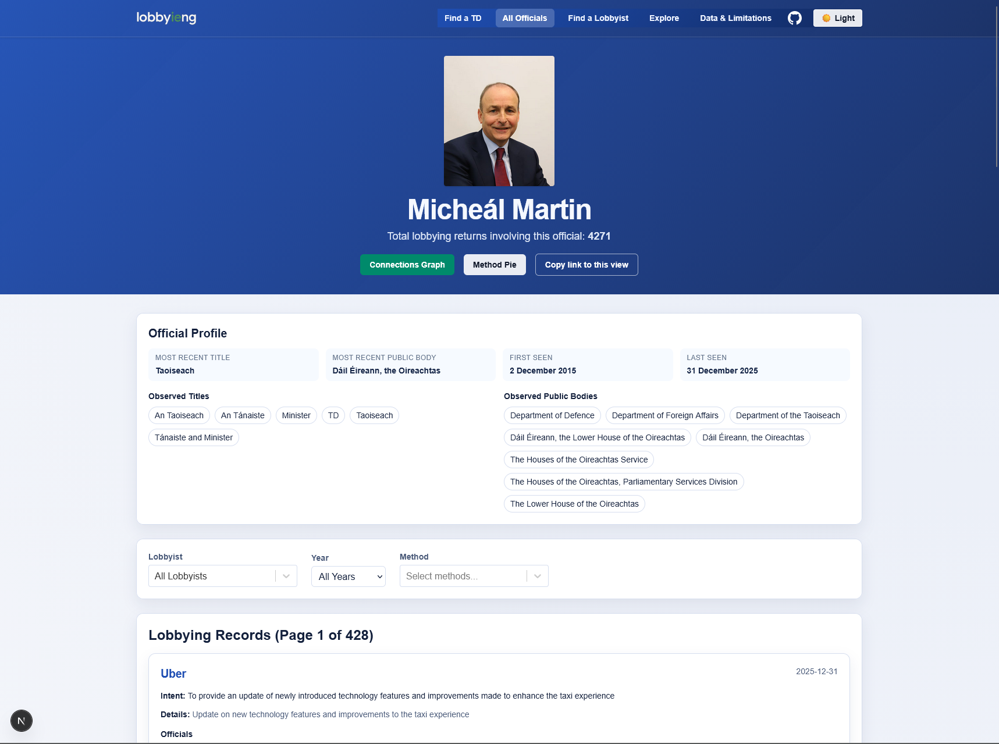

# Lobbyieng

Lobbyieng visualises lobbying activity in Ireland. It scrapes the official Register of Lobbying, links records to elected officials, and presents it in a searchable, interactive UI.

## Screenshots





## 🚀 Features

- Browse records by official or lobbyist
- Filter by year, method (meetings, emails, calls, etc.), job title, or name
- Force‑directed graph of connections (react‑force‑graph‑2d)
- Chord diagram to compare two officials
- Pie charts for method breakdown (Chart.js)

## 🔧 Tech Stack

- **Framework:** Next.js (SSR + API routes)
- **UI:** React, Tailwind CSS, react-select
- **Data:** SQLite (lobbying.db)
- **Charts:** react-chartjs-2, react-force-graph-2d

## ⚙️ Getting Started

### Prerequisites

- Node.js ≥14
- npm or yarn
- Python ≥3.8
- SQLite3
- Required Python packages: `sqlalchemy`, `requests`

### Clone & Install

```bash
git clone https://github.com/robmcelhinney/lobbyieng.git
cd lobbyieng
npm install     # or yarn
```

### Python Environment (uv)

This repo uses `uv` for Python dependency management.

```bash
uv sync
```

### Local Data Inputs Not Included in Git

A fresh clone does not include the source data inputs needed to build the full app database:

- `data/Lobbying_ie_returns_results*.csv` - Register of Lobbying CSV exports that you download manually.
- `data/derived/committee_memberships.json` - generated by the committee membership fetch script.

These outputs are generated by `parser.py` during `npm run build:db` or Docker build:

- `data/derived/explore_insights.json` - generated by `parser.py`.
- `lobbying.db` - generated by `parser.py`.

The committed TD thumbnail images in `public/images/td_thumbnails/` are available after clone. The thumbnail script is only needed when you want to refresh them.

### 📦 Build the Database (`lobbying.db`)

1. Select relevant data from https://www.lobbying.ie/app/home/search by using CSV export
1. Store CSVs in the `data/` directory.
1. Optionally refresh current committee memberships before building the database:

   ```bash
   uv run python scripts/fetch_committee_memberships.py
   ```

1. Run the parser to ingest CSVs into SQLite:

   ```bash
   npm run build:db
   ```

   - This script (`parser.py`) drops and recreates tables, normalises names, and populates:
     - `lobbying_records`
     - `dpo_entries`
     - `lobbying_activity_entries`
     - `committees` and `committee_memberships` when `data/derived/committee_memberships.json` exists
     - `data/derived/explore_insights.json`

1. After ingesting, indexes are created automatically for faster queries.

Alternatively:

```bash
make build-db
```

### 🖼️ Fetch Oireachtas Thumbnails (optional)

Dáil member thumbnail images are committed in `public/images/td_thumbnails/`. To refresh them:

```bash
uv run python download-oireachtas-images.py
```

Senator thumbnails are stored separately in `public/images/senator_thumbnails/`:

```bash
uv run python download-oireachtas-images.py --chamber seanad
```

### 🏛️ Fetch Current Committee Memberships (optional)

To refresh current Oireachtas committee memberships from `oireachtas.ie`:

```bash
uv run python scripts/fetch_committee_memberships.py
```

This writes `data/derived/committee_memberships.json`. Run this before `npm run build:db` if you want the rebuilt
database to include current committee context.

### Run the App

```bash
npm run dev
# Visit http://localhost:3000
```

## 🚢 Production Deployment Notes

### Option 1: Docker Compose

```bash
docker compose build
docker compose up -d
```

The Docker build runs `parser.py`, so it generates `lobbying.db` and `data/derived/explore_insights.json` inside the
image. It does not fetch committee memberships; run `uv run python scripts/fetch_committee_memberships.py` before
`docker compose build` if you want committee data imported.

This uses:

- `Dockerfile` for the Next.js app image
- `docker-compose.yml` for service orchestration
- `nginx.conf` for reverse-proxy behavior

### Option 2: Docker + Nginx

Build and run the app container:

```bash
docker build -t lobbyieng .
docker run -d --name lobbyieng -p 3000:3000 lobbyieng
```

Then point your host Nginx virtual host (or containerized Nginx) at `http://127.0.0.1:3000`, using `nginx.conf` as a baseline.

### Recommended production order

1. Ensure Register CSV exports exist in `data/`.
2. Optionally refresh committee memberships with `uv run python scripts/fetch_committee_memberships.py`.
3. Build/refresh `lobbying.db` with `npm run build:db`, or let the Docker build run `parser.py`.
4. Build the app image (`docker build` or `docker compose build`).
5. Start app services.
6. Put Nginx in front for TLS termination and caching headers.

## 🛠️ API Endpoints

- **GET** `/api/officials?period=All&job_titles=TD,Minister` — list officials
- **GET** `/api/officials/[slug]?[page,year,method,lobbyist,per_page]` — detail + filters
- **GET** `/api/officials/[slug]/methods` — method breakdown
- **GET** `/api/lobbyists?period=` — list lobbyists
- **GET** `/api/lobbyists/[slug]?[page,year,method,official]` — lobbyist detail
- **GET** `/api/chord-data?officials=slug1,slug2&start_year&end_year` — chord JSON
- **GET** `/api/periods` — all periods
- **GET** `/api/periods-latest` — latest period
- **GET** `/api/data-metadata` — dataset coverage, freshness, and summary counts

## 📖 Pages

- **/** Home overview
- **/dail** Search Dáil members
- **/officials** Browse officials
- **/officials/[slug]** Official detail
- **/lobbyists** Browse lobbyists
- **/lobbyists/[slug]** Lobbyist detail
- **/chord** Compare two officials
- **/connections/[slug]** Force graph
- **/methods/[slug]** Pie chart
- **/data-limitations** Data coverage, update cadence, and limitations

## Data Source & Limitations

- Source: CSV exports from the official [Register of Lobbying](https://www.lobbying.ie/).
- Coverage and freshness are surfaced in-app at `/data-limitations`, including:
  - period range and first/latest published return dates
  - latest local database refresh timestamp
- Reporting cadence: Ireland's register uses four-month reporting cycles.
- Known caveats include:
  - name normalization and variant matching can be imperfect
  - source exports may include duplicates/amendments that need interpretation
  - occasional missing or inconsistent DPO/official details in source data

## 🙏 Acknowledgements

Thanks to the Register of Lobbying at [lobbying.ie](https://www.lobbying.ie) for providing open, official data on Irish lobbying activity, which makes this project possible.

## 🤝 Contributing

1. Fork it
1. Create a branch (`git checkout -b feature/XYZ`)
1. Commit (`git commit -m "feat: add XYZ"`)
1. Push (`git push origin feature/XYZ`)
1. Open a PR

## 📜 License

MIT © Robert McElhinney
